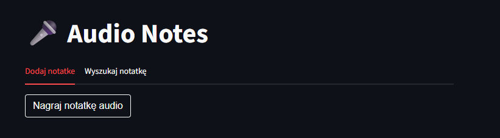
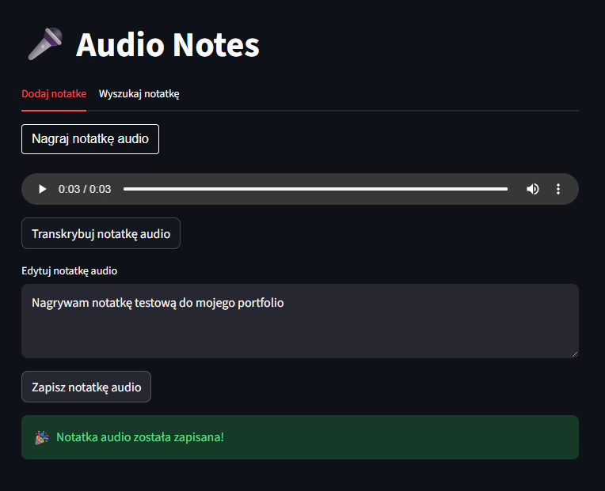
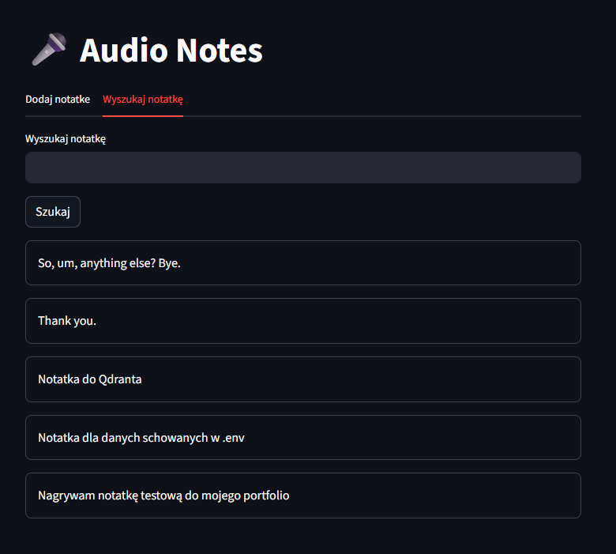

# **Aplikacja Audio Notes**

Zapraszam do zapoznania się z moim projektem aplikacji **Audio Notes**. 

Ta aplikacja to prosty system do tworzenia, transkrypcji, zapisywania i wyszukiwania notatek głosowych oparty o AI.

<a href="https://audionotes-karol.streamlit.app/" class="md-button md-button--primary" target="_blank" rel="noopener noreferrer">Audio Notes</a>

>
WAŻNE!
 Do funkcjonowania aplikacji konieczny jest klucz API OpenAI.

### **Główne funkcjonalności aplikacji**
Aplikacja składa się z dwóch głównych zakładek: dodawanie notatek audio i wyszukiwanie notatek.

#### 1. Dodawanie notatek audio

**Użytkownik może:** 
* nagrać notatkę głosową bezpośrednio w przeglądarce, 
* odsłuchać nagranie, 
* wysłać nagranie do modelu Whisper od OpenAI, 
* otrzymać automatyczną transkrypcję mowy na tekst, 
* ręcznie edytować tekst notatki, 
* zapisać notatkę do bazy wektorowej. 

**Proces wygląda następująco:** 
* nagranie audio przez mikrofon 
* konwersja nagrania do formatu MP3 
* transkrypcja audio → tekst 
* wygenerowanie embeddingu tekstowego 
* zapis embeddingu i treści notatki w Qdrant Cloud 

#### 2. Wyszukiwanie notatek audio

**Użytkownik może:** 
* wpisać dowolne zapytanie tekstowe, 
* wyszukać podobne semantycznie notatki, 
* zobaczyć trafność wyników (`score`). 

**Aplikacja wykorzystuje:** 
* embeddingi 
* wyszukiwanie semantyczne 
* similarity search 

Dzięki temu użytkownik może znaleźć notatkę nawet wtedy, gdy użyto innych słów o podobnym znaczeniu.

### **Wykorzystane technologie**

1. **Streamlit**
2. **OpenAI API**
    - model `whisper-1` (speech-to-text)
    - model `text-embedding-3-large`
3. **Qdrant**
4. **streamlit-audiorecorder**
5. **python-dotenv**

### **Elementy techniczne**

1. **Session state** 
Aplikacja wykorzystuje `st.session_state` do przechowywania audio, transkrypcji, klucza OpenAI.
2. **MD5 Hash** 
`current_md5 = md5(st.session_state["note_audio_bytes"]).hexdigest()` 
Służy do wykrywania zmiany nagrania i uniknięcia ponownej transkrypcji tego samego audio.
3. **Cache resource** 
`@st.cache_resource` 
Wykorzystywane dla klienta Qdrant. 
Dzięki temu połączenie z bazą nie jest tworzone wielokrotnie i aplikacja działa szybciej.

### **Link GitHub**
<a href="https://github.com/kbierko/audio_notes_v6_wdrozenie" class="md-button" target="_blank" rel="noopener noreferrer">:simple-github: Audio Notes</a>

 
Poniżej zamieszczam do wglądu plik app.py

<a href="app.py" class="md-button" target="_blank" rel="noopener noreferrer">Pobierz plik app.py</a>