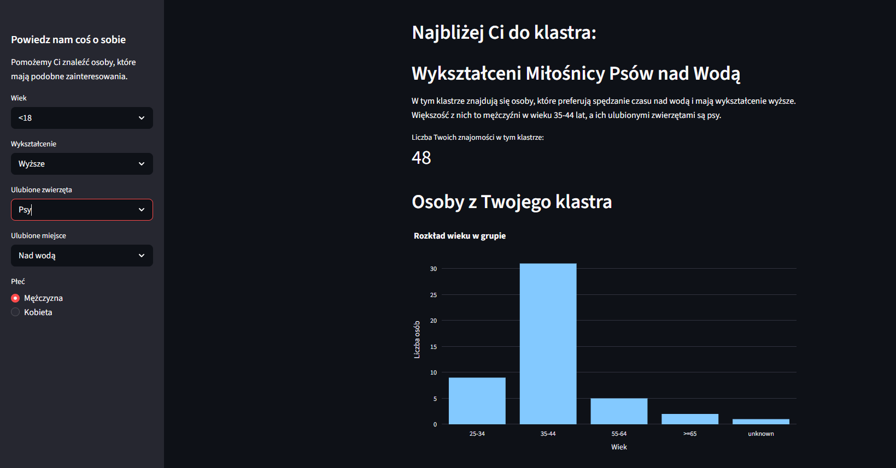
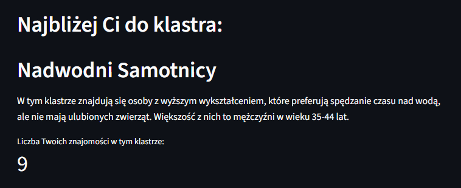
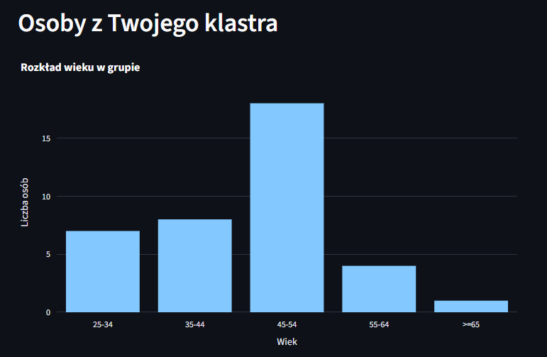
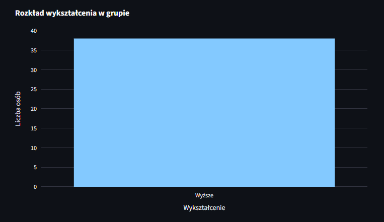
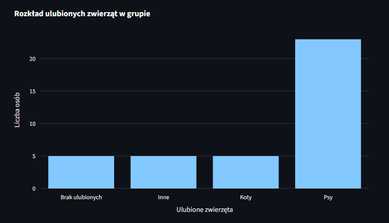
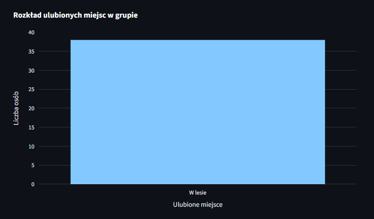
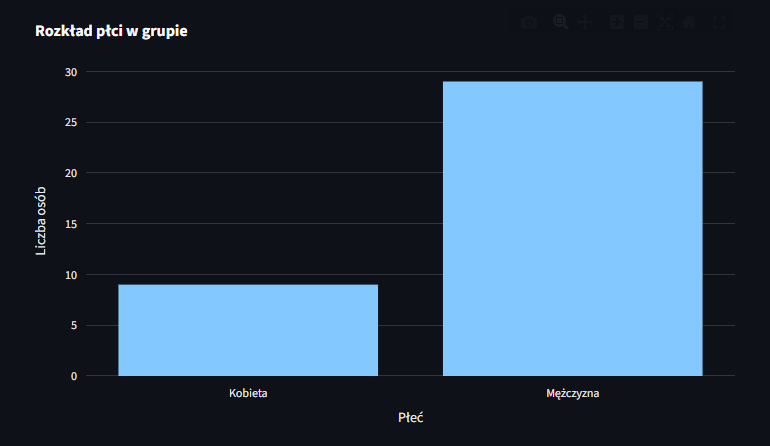

# **Aplikacja Find Friends**

Zapraszam do zapoznania się z moim projektem aplikacji **Find Friends**. 

<a href="https://find-friends-v4.streamlit.app/" class="md-button md-button--primary" target="_blank" rel="noopener noreferrer">Find Friends</a>

Ta aplikacja została stworzona w celu dopasowywania użytkownika do grupy osób o podobnych cechach i zainteresowaniach na podstawie prostego formularza ankietowego. 
W praktyce działa jak mini system rekomendacji znajomości wykorzystujący klasteryzację danych.

### **Funkcjonalności aplikacji**

#### 1. Formularz użytkownika (sidebar)
Po lewej stronie aplikacji użytkownik wprowadza informacje o sobie:
        
        * wiek
        * poziom wykształcenia
        * ulubione zwierzęta
        * ulubione miejsce
        * płeć

Dane są wybierane za pomocą komponentów:
   
        * selectbox
        * radio

Następnie dane są zapisywane do obiektu `DataFrame` (`person_df`). 

#### 2. Wczytanie modelu ML 
Aplikacja ładuje wcześniej wytrenowany model klasteryzacji: `load_model(MODEL_NAME)`. 
Model został zapisany wcześniej przy pomocy biblioteki PyCaret. 

Do optymalizacji wykorzystano `@st.cache_data`. 
Dzięki temu model nie jest ładowany przy każdym odświeżeniu i aplikacja działa szybciej.

#### 3. Predykcja klastra użytkownika 
Model analizuje dane użytkownika `predict_model(model, data=person_df)` i przypisuje go do odpowiedniego klastra. 
Każdy klaster posiada nazwę i opis, które są pobierane z pliku JSON `welcome_survey_cluster_names_and_descriptions_v2.json`.

Te informacje zostały zapisane tam wcześniej z wykorzystaniem skryptu do automatycznego generowania nazw i opisów klastrów utworzonych przez model ML. 
W tym celu została użyta biblioteka `PyCaret` i wytrenowany model klasteryzacji `K-Means`.

Poniżej zamieszczam do wglądu pliki z klasteryzacji i nazywania klastrów. 

<a href="clustering.html" class="md-button" target="_blank" rel="noopener noreferrer">clustering</a>
<a href="clusters_naming.html" class="md-button" target="_blank" rel="noopener noreferrer">clusters_naming</a>

#### 4. Analiza osób z tego samego klastra 
**Aplikacja:**

        * wczytuje pełny zbiór uczestników
        * przypisuje klastry wszystkim osobom
        * filtruje osoby należące do tego samego klastra co użytkownik
    
`same_cluster_df = all_df[all_df["Cluster"] == predicted_cluster_id]`

#### 5. Statystyki grupy
Wyświetlana jest liczba osób w danym klastrze: 
`st.metric("Liczba Twoich znajomości w tym klastrze:", len(same_cluster_df))`

#### 6. Wizualizacja danych
Aplikacja generuje histogramy pokazujące rozkład cech w grupie: 
    
        * wieku
        * wykształcenia
        * ulubionych zwierząt
        * ulubionych miejsc
        * płci

Wykresy są tworzone przy pomocy `Plotly`

`fig = px.histogram(same_cluster_df.sort_values("age"), x="age")`

`fig = px.histogram(same_cluster_df.sort_values("edu_level"), x="edu_level")`

`fig = px.histogram(same_cluster_df.sort_values("fav_animals"), x="fav_animals")`

`fig = px.histogram(same_cluster_df.sort_values("fav_place"), x="fav_place")`

`fig = px.histogram(same_cluster_df.sort_values("gender"), x="gender")`

### **Wykorzystane technologie**

1. **Streamlit**
        
        * st.sidebar
        * st.selectbox
        * st.metric
        * ...

2. **Pandas**
        
        * pd.read_csv()
        * pd.DataFrame()
        * ...

3. **PyCaret**
        
        * load_model()
        * predict_model()

4. **Plotly**
        
        * px.histogram()

5. **JSON**

5. **CSV**

### **Link GitHub**
<a href="https://github.com/kbierko/find_friends_v4" class="md-button" target="_blank" rel="noopener noreferrer">:simple-github: Find Friends</a>

 
Poniżej zamieszczam do wglądu plik app.py

<a href="app.py" class="md-button">Pobierz plik app.py</a>