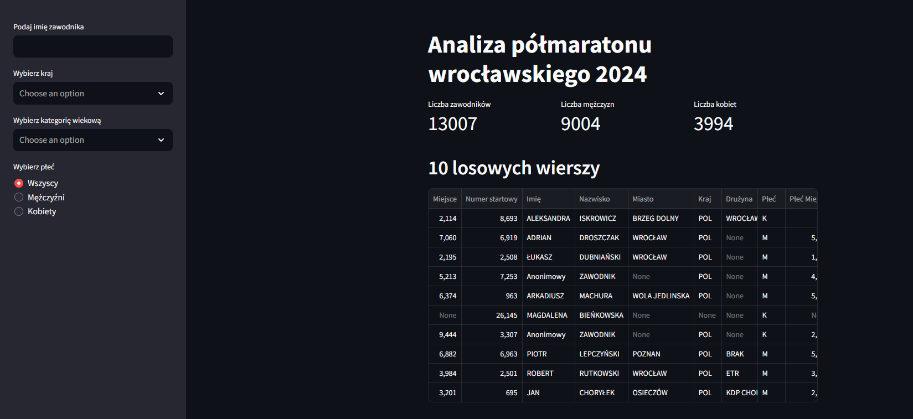

# **Aplikacja Halfmarathon**

Zapraszam do zapoznania się z moim projektem aplikacji **Halfmarathon**. 

<a href="https://halfmarathon-wroclaw.streamlit.app/" class="md-button md-button--primary" target="_blank" rel="noopener noreferrer">Halfmarathon</a>

Aplikacja została stworzona w celu analizy wyników uczestników półmaratonu wrocławskiego z 2024 roku. 
Umożliwia filtrowanie danych zawodników oraz wizualizację najważniejszych statystyk dotyczących biegu.

### **Funkcjonalności aplikacji**

#### 1. Filtrowanie zawodników po:
    * imieniu
    * kraju pochodzenia
    * kategorii wiekowej
    * płci
#### 2. Prezentacja podstawowych statystyk:
    * liczba wszystkich zawodników
    * liczba mężczyzn
    * liczba kobiet
#### 3. Wyświetlanie:
    * 10 losowych rekordów z datasetu
    * TOP 5 zawodników według miejsca na mecie
#### 4. Wizualizacja danych:
    * wykres słupkowy przedstawiający pochodzenie zawodników
    * histogram czasów ukończenia biegu wraz z krzywą rozkładu
    * macierz korelacji dla danych numerycznych

### **Wykorzystane technologie**

1. **Streamlit**
      
        * st.sidebar
        * st.multiselect
        * st.metric
        * ...

2. **Pandas**
    
        * pd.read_csv()
        * pd.to_datetime()

3. **Matplotlib**
    
        * plt.figure()

4. **Seaborn**
    
        * sns.histplot()
        * sns.heatmap()

Aplikacja pozwala w prosty i interaktywny sposób analizować wyniki półmaratonu oraz odkrywać zależności pomiędzy danymi zawodników.

### **Link GitHub**
<a href="https://github.com/kbierko/halfmarathon_v2" class="md-button" target="_blank" rel="noopener noreferrer">:simple-github: Halfmarathon</a>

 
Poniżej zamieszczam do wglądu plik app.py

<a href="app.py" class="md-button">Pobierz plik app.py</a>