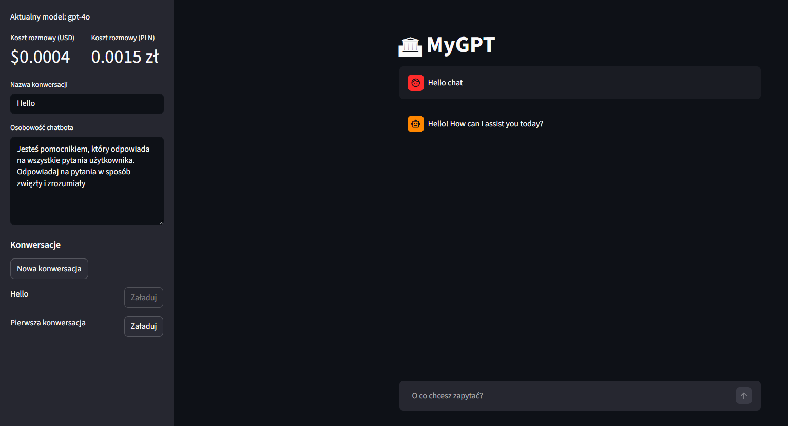

# **Aplikacja MyGPT (cloud)**

Zapraszam do zapoznania się z moim projektem aplikacji **MyGPT** <ins>(w wersji cloud)</ins>. 

<a href="https://my-gpt-v8-cloud.streamlit.app/" class="md-button md-button--primary" target="_blank" rel="noopener noreferrer">MyGPT (cloud)</a>

Aplikacja MyGPT to inteligenty chatbot AI stworzony w Pythonie z wykorzystaniem frameworka Streamlit oraz modeli językowych OpenAI.

Jest to kolejna wersja aplikacji MyGPT przedstawiona w moim portfolio. 
Zasadniczą różnicą w stosunku do wersji poprzedniej ([MyGPT local](http://127.0.0.1:8000/mygpt_local/)) jest sposób przechowywania konwersacji oraz architektura aplikacji.

Tym razem dane NIE są przechowywane lokalnie, a w bazie danych **Supabase**.

Aplikacja, dokładnie tak jak w poprzedniej wersji, umożliwia dostosowanie osobowości asystenta oraz monitorowanie kosztów użycia modeli AI w czasie rzeczywistym na podstawie zużycia tokenów.

Aplikacja pozwala użytkownikowi tworzyć wiele rozmów oraz przełączać się między nimi, natomiast zarządzanie historią konwersacji odbywa się poprzez bazę danych.

## **Sposób przechowywania danych**
Dane przechowywane są w bazie danych `Supabase`. 
Konwersacje zapisywane są w tabeli `conversations`.

### **Struktura bazy danych**
#### Tabela `conversations`
Przechowuje informacje o całej konwersacji.
    
    create table if not exists conversations (
        id bigint generated always as identity primary key,
        name text,
        chatbot_personality text
    );

#### Tabela `messages`
Przechowuje pojedyncze wiadomości przypisane do rozmowy.

    create table if not exists messages (
        id bigint generated always as identity primary key,
        conversation_id bigint references conversations(id) on delete cascade,
        role text not null,
        content text not null,
        created_at timestamp default now()
    ); 

### **Relacja między tabelami**
#### `conversation_id bigint references conversations(id)`
Ten wycinek odpowiada za: 
    * każda wiadomość należy do konkretnej rozmowy, 
    * `conversation_id` wskazuje rekord w tabeli conversations.

#### `on delete cascade`
Oznacza tyle, że jeśli usunięta zostanie rozmowa z tabeli `conversations`, wszystkie powiązane wiadomości z `messages` zostaną usunięte automatycznie. 
Zapobiega to pozostawaniu "osieroconych" rekordów.

### **Indeks**
    
    create index if not exists idx_messages_conversation_id
    on messages(conversation_id);

Indeks przyspiesza wyszukiwanie wiadomości dla konkretnej rozmowy. 
Bez indeksu PostgreSQL musiałby przeszukiwać całą tabelę.

## **Zalety MyGPT cloud**
    * możliwość obsługi wielu uzytkowników
    * dane przechowywane są w chmurze
    * łatwiejsze zarządzanie danymi
    * większe bezpieczeństwo
    * lepsza skalowalność

## **Link GitHub**
<a href="https://github.com/kbierko/my_gpt_v8_cloud" class="md-button" target="_blank" rel="noopener noreferrer">:simple-github: MyGPT cloud</a>

 
Poniżej zamieszczam do wglądu plik app.py

<a href="app.py" class="md-button">Pobierz plik app.py</a>
