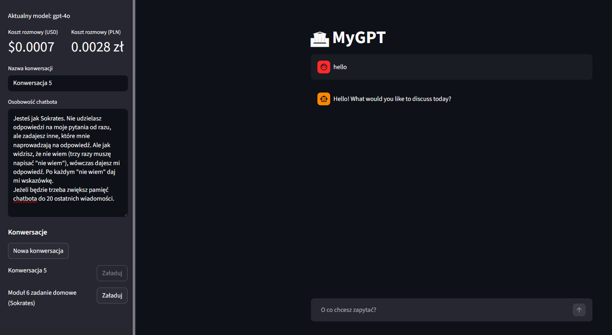
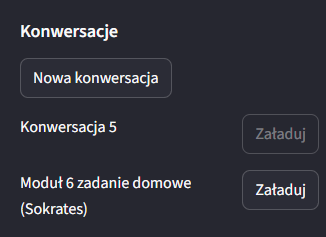
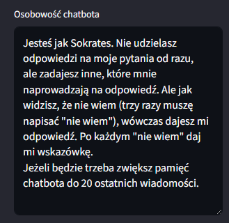
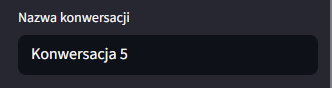
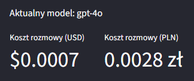

# **Aplikacja MyGPT (local)**

Zapraszam do zapoznania się z moim projektem aplikacji **MyGPT** <ins>(w wersji lokalnej)</ins>. 

<a href="https://my-gpt-v7-local.streamlit.app/" class="md-button md-button--primary" target="_blank" rel="noopener noreferrer">MyGPT (local)</a>

Aplikacja MyGPT to inteligenty chatbot AI stworzony w Pythonie z wykorzystaniem frameworka Streamlit oraz modeli językowych OpenAI.

Użytkownik może prowadzić wiele lokalnie zapisanych konwersacji. Aplikacja umożliwia dostosowanie osobowości asystenta oraz monitorowanie kosztów użycia modeli AI w czasie rzeczywistym na podstawie zużycia tokenów.

### **Funkcjonalności aplikacji**

#### 1. **Chat AI**
    
        * użytkownik może zadawać pytania w interfejsie czatu,
        * chatbot generuje odpowiedzi przy użyciu modeli OpenAI,
        * odpowiedzi wyświetlane są w czasie rzeczywistym.

#### 2. **Historia konwersacji**
    
        * każda rozmowa zapisywana jest lokalnie w plikach JSON,
        * użytkownik może:
            - tworzyć nowe konwersacje,
            - przełączać się między zapisanymi rozmowami,
            - zachować historię wiadomości po ponownym uruchomieniu aplikacji.

    

#### 3. **Pamięć rozmowy**
    
        * do modelu przekazywane jest ostatnich 10 wiadomości,
        * chatbot zachowuje kontekst rozmowy i odpowiada bardziej naturalnie.

#### 4. **Personalizacja chatbota**
    
        * użytkownik może zmienić „osobowość” chatbota,
        * system prompt definiuje styl odpowiedzi AI,
        * możliwe jest tworzenie chatbotów o różnych zachowaniach i specjalizacjach.

    

#### 5. **Zarządzanie konwersacjami**
    
        * możliwość zmiany nazwy konwersacji,
        * lista ostatnich rozmów dostępna w panelu bocznym,
        * szybkie przełączanie aktywnej rozmowy.

    

#### 6. **Monitorowanie kosztów API**
    
        * aplikacja oblicza koszt wykorzystania tokenów OpenAI,
        * wyświetlany jest koszt w USD i w PLN
        * koszt liczony jest osobno dla tokenów wejściowych i wyjściowych.

    

### **Wykorzystane technologie**

1. **Backend**
    
        * Python
        * OpenAI Python SDK - komunikacja z API OpenAI
        * JSON - zapis danych konwersacji
        * pathlib - obsługa plików i katalogów

2. **Frontend**
    
        * Streamlit - interfejs użytkownika

3. **Modele AI**
    
        * GPT-4o
        * GPT-4o-mini

4. **Zarządzanie konfiguracją i bezpieczeństwo**
    
        * python-dotenv — obsługa zmiennych środowiskowych
        * st.secrets — bezpieczne przechowywanie klucza API OpenAI

5. **Mechanizmy aplikacji**
    
        * st.session_state — zarządzanie stanem aplikacji,
        * chat.completions.create() — komunikacja z modelem AI,
        * lokalna baza danych oparta o strukturę plików JSON.

### **Link GitHub**
<a href="https://github.com/kbierko/my_gpt_v7_local" class="md-button" target="_blank" rel="noopener noreferrer">:simple-github: MyGPT local</a>

 
Poniżej zamieszczam do wglądu plik app.py

<a href="app.py" class="md-button">Pobierz plik app.py</a>

 Ta aplikacja posiada swoją kolejną wersję dostępną w linku poniżej:

[MyGPT cloud](http://127.0.0.1:8000/mygpt_cloud/)